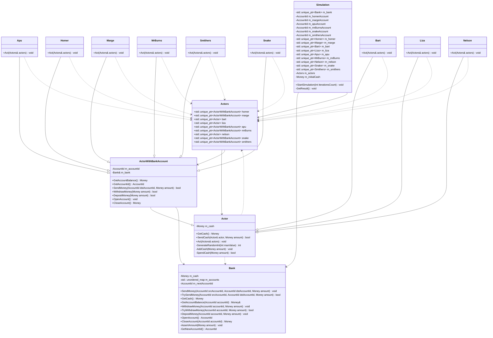

```mermaid
classDiagram
    class Bank {
        -Money m_cash
        -std:: unordered_map<AccountId, Money> m_accounts
        -AccountId m_nextAccountId
        +SendMoney(AccountId srcAccountId, AccountId dstAccountId, Money amount) void
        +TrySendMoney(AccountId srcAccountId, AccountId dstAccountId, Money amount) bool
        +GetCash() Money
        +GetAccountBalance(AccountId accountId) Money&
        +WithdrawMoney(AccountId accountId, Money amount) void
        +TryWithdrawMoney(AccountId accountId, Money amount) bool
        +DepositMoney(AccountId accountId, Money amount) void
        +OpenAccount() AccountId
        +CloseAccount(AccountId accountId) Money
        -AssertAmount(Money amount) void
        -GetNewAccountId() AccountId
    }
    class Simulation {
        -std::unique_ptr~Bank~ m_bank
        -AccountId m_homerAccount
        -AccountId m_margeAccount
        -AccountId m_apuAccount
        -AccountId m_mrBurnsAccount
        -AccountId m_snakeAccount
        -AccountId m_smithersAccount
        -std::unique_ptr~Homer~ m_homer
        -std::unique_ptr~Marge~ m_marge
        -std::unique_ptr~Bart~ m_bart
        -std::unique_ptr~Liza~ m_liza
        -std::unique_ptr~Apu~ m_apu
        -std::unique_ptr~MrBurns~ m_mrBurns
        -std::unique_ptr~Nelson~ m_nelson
        -std::unique_ptr~Snake~ m_snake
        -std::unique_ptr~Smithers~ m_smithers
        -Actors m_actors
        -Money m_initialCash
        +StartSimulation(int iterationsCount) void
        -GetResult() void
    }
    class Actors {
        +std::unique_ptr~ActorWithBankAccount~ homer
        +std::unique_ptr~ActorWithBankAccount~ marge
        +std::unique_ptr~Actor~ bart
        +std::unique_ptr~Actor~ liza
        +std::unique_ptr~ActorWithBankAccount~ apu
        +std::unique_ptr~ActorWithBankAccount~ mrBurns
        +std::unique_ptr~Actor~ nelson
        +std::unique_ptr~ActorWithBankAccount~ snake
        +std::unique_ptr~ActorWithBankAccount~ smithers
    }
    class Apu {
        +Act(Actors& actors) void
    }
    class Bart {
        +Act(Actors& actors) void
    }
    class Homer {
        +Act(Actors& actors) void
    }
    class Liza {
        +Act(Actors& actors) void
    }
    class Marge {
        +Act(Actors& actors) void
    }
    class MrBurns {
        +Act(Actors& actors) void
    }
    class Nelson {
        +Act(Actors& actors) void
    }
    class Smithers {
        +Act(Actors& actors) void
    }
    class Snake {
        +Act(Actors& actors) void
    }
    class Actor {
        -Money m_cash
        +GetCash() Money
        +SendCash(Actor& actor, Money amount) bool
        +Act(Actors& actors) void
        -GenerateRandomInt(int maxValue) int
        -AddCash(Money amount) void
        -SpendCash(Money amount) bool
    }
    class ActorWithBankAccount {
        -AccountId m_accountId
        -Bank& m_bank
        +GetAccountBalance() Money
        +GetAccountId() AccountId
        +SendMoney(AccountId dstAccountId, Money amount) bool
        +WithdrawMoney(Money amount) bool
        +DepositMoney(Money amount) bool
        +OpenAccount() void
        +CloseAccount() Money
    }

    ActorWithBankAccount --|> Actor
    ActorWithBankAccount --> Bank
    Actors --> Actor
    Actors --> ActorWithBankAccount
    Actor ..> Actors
    Simulation --> Bank
    Simulation --> Actors
    Apu --|> ActorWithBankAccount
    Apu ..> Actors
    Bart --|> Actor
    Bart ..> Actors
    Homer --|> ActorWithBankAccount
    Homer ..> Actors
    Liza --|> Actor
    Liza ..> Actors
    Marge --|> ActorWithBankAccount
    Marge ..> Actors
    MrBurns --|> ActorWithBankAccount
    MrBurns ..> Actors
    Nelson --|> Actor
    Nelson ..> Actors
    Smithers --|> ActorWithBankAccount
    Smithers ..> Actors
    Snake --|> ActorWithBankAccount
    Snake ..> Actors
    Actor ..> Bank
```