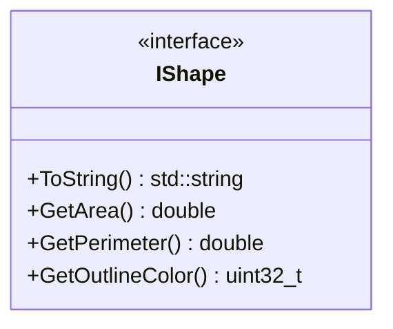

```mermaid
classDiagram
    class  IShape {
        <<interface>>
        +ToString() std::string
        +GetArea() double
        +GetPerimeter() double
        +GetOutlineColor() uint32_t
    }
```