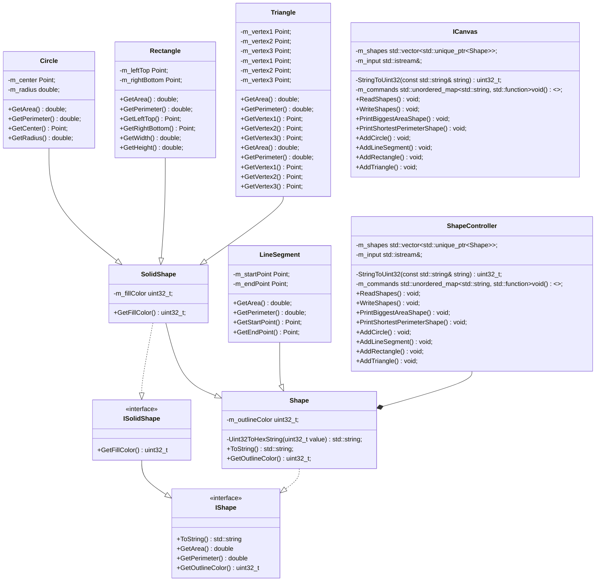

```mermaid
classDiagram
    class IShape {
        <<interface>>
        +ToString() std::string
        +GetArea() double
        +GetPerimeter() double
        +GetOutlineColor() uint32_t
    }
    class ISolidShape {
        <<interface>>
        +GetFillColor() uint32_t
    }
    class Shape {
        -Uint32ToHexString(uint32_t value) std::string;
        -m_outlineColor uint32_t;
        +ToString() std::string;
        +GetOutlineColor() uint32_t;
    }
    class SolidShape {
        -m_fillColor uint32_t;
        +GetFillColor() uint32_t;
    }
    class Circle {
        -m_center Point;
        -m_radius double;
        +GetArea() double;
        +GetPerimeter() double;
        +GetCenter() Point;
        +GetRadius() double;
    }
    class LineSegment { 
        -m_startPoint Point;
        -m_endPoint Point;
        +GetArea() double;
        +GetPerimeter() double;
        +GetStartPoint() Point;
        +GetEndPoint() Point;
    }
    class Rectangle {
        -m_leftTop Point;
        -m_rightBottom Point;
        +GetArea() double;
        +GetPerimeter() double;
        +GetLeftTop() Point;
        +GetRightBottom() Point;
        +GetWidth() double;
        +GetHeight() double;
    }
    class Triangle {
        -m_vertex1 Point;
        -m_vertex2 Point;
        -m_vertex3 Point;
        +GetArea() double;
        +GetPerimeter() double;
        +GetVertex1() Point;
        +GetVertex2() Point;
        +GetVertex3() Point;
    }
    class ShapeController {
        -StringToUint32(const std::string& string) uint32_t;
        -m_shapes std::vector~std::unique_ptr~Shape~~;
        -m_input std::istream&;
        -m_commands std::unordered_map~std::string, std::function~void()~~;
        +ReadShapes() void;
        +WriteShapes() void;
        +PrintBiggestAreaShape() void;
        +PrintShortestPerimeterShape() void;
        +AddCircle() void;
        +AddLineSegment() void;
        +AddRectangle() void;
        +AddTriangle() void;
    }
    class Triangle {
        -m_vertex1 Point;
        -m_vertex2 Point;
        -m_vertex3 Point;
        +GetArea() double;
        +GetPerimeter() double;
        +GetVertex1() Point;
        +GetVertex2() Point;
        +GetVertex3() Point;
    }
    class ICanvas {
        -StringToUint32(const std::string& string) uint32_t;
        -m_shapes std::vector~std::unique_ptr~Shape~~;
        -m_input std::istream&;
        -m_commands std::unordered_map~std::string, std::function~void()~~;
        +ReadShapes() void;
        +WriteShapes() void;
        +PrintBiggestAreaShape() void;
        +PrintShortestPerimeterShape() void;
        +AddCircle() void;
        +AddLineSegment() void;
        +AddRectangle() void;
        +AddTriangle() void;
    }
    
    Shape ..|> IShape
    SolidShape ..|> ISolidShape
    ISolidShape --|> IShape
    SolidShape --|> Shape
    Circle --|> SolidShape
    LineSegment --|> Shape
    Rectangle --|> SolidShape
    Triangle --|> SolidShape
    ShapeController --* Shape
```